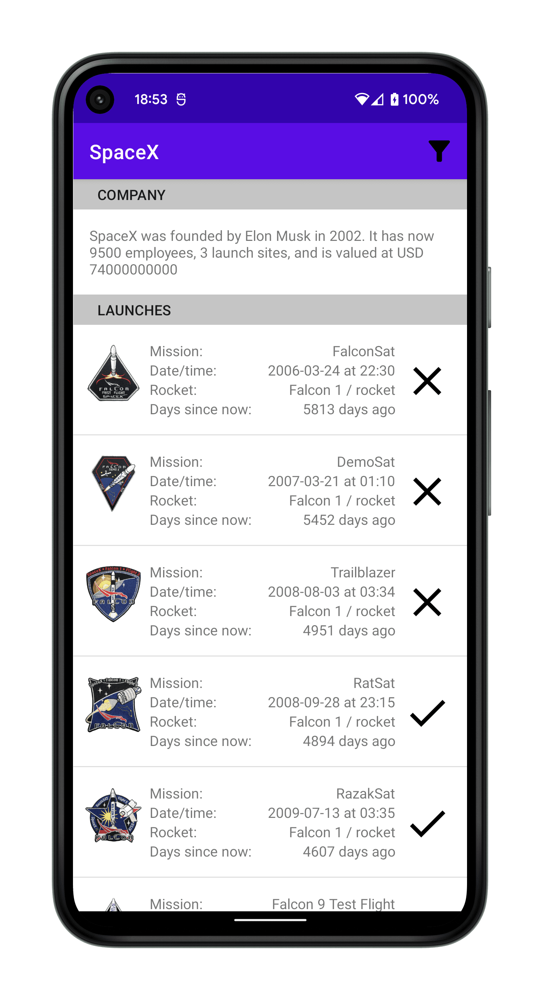
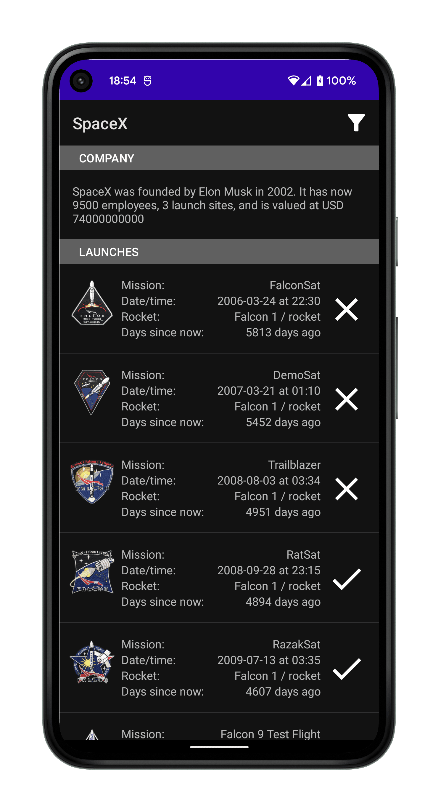

# SpaceX API Android Client

<p float="left">
  
  
</p>

### Overview

SpaceX API Android client, allowing to get company information & launch data. Launches can be sorted by date and filtered by launch status (successful/failed) and a specific year. Webcast/wiki/article links can be opened by clicking on a desired launch tile. The client also **works offline**.

<br>

### Tech Stack

<hr>

- App:
  - DI: Koin
  - Coroutines
  - Navigation component
  - Remote Networking: OkHttp + Retrofit + Moshi
  - Local DB: Room
  - Image caching: Coil
- Tests:
  - MockK
  - StriKT (assertions)
  - Espresso

<br>

### High-level design

<hr>

[Open in draw.io](https://drive.google.com/file/d/1VyL3SQWdsXMWnkCpl57tjIKqt_8wvbEK/view?usp=sharing)

<br>

### Tradeoffs

Instead of supporting pagination and allowing user to load launches bit by bit as they scroll down the list, I wanted to provide a fully-fledged sorting & filtering experience even when offline.

Given the size of the dataset that did not seem unreasonable, so the solution loads & caches all the data into a DB. The user can then go offline and still use the app, or trigger a refresh if they want to update their data.

<br>

### Testing

<hr>

- Unit tests:
  - data (model mappings)
  - repository (data retrieval & caching)
  - domain (usecases)
  - view model
- Instrumented tests:
  - fragment (Espresso UI)
  - local DB (Room queries)

Make sure you run instrumented tests **with the device screen unlocked**, otherwise you may face the following
error:

```
java.lang.IllegalStateException: Can not perform this action after onSaveInstanceState
```

Unit tests:

```bash
./gradlew test
```

Instrumentation tests (only supports `debug` build type):

```bash
./gradlew connectedAndroidTest
```

<br>

### Decisions

<hr>

#### `/launches/query` endpoint

The regular all launches endpoint includes only an id reference to the rocket, since it's an object
from another collection, so it is not enough to retrieve the required rocket `name` and `type`
fields.

Instead of doing a second request to look up rocket info to `/rockets`, I've consulted
with [the wiki](https://github.com/r-spacex/SpaceX-API/blob/master/docs/queries.md) to switch
to `/launches/query` instead & get the required rocket info as part of the single request.

<br>

#### Nullability of fields

<hr>

Based on the provided
services [SpaceX-API discussion](https://github.com/r-spacex/SpaceX-API/issues/290#issuecomment-582650941), most of the fields can be null. So, in the design the domain model parameters are mostly nullable, and naturally, that's propagated throughout the layers of the client app.

<br>

### v4 vs v5 API endpoints

<hr>

I was considering to use the same version for all of the endpoints, but switched to the
available `v5` for launches, since the data is not coupled to the company info `v4` endpoint and can be iterated separately.

<br>
